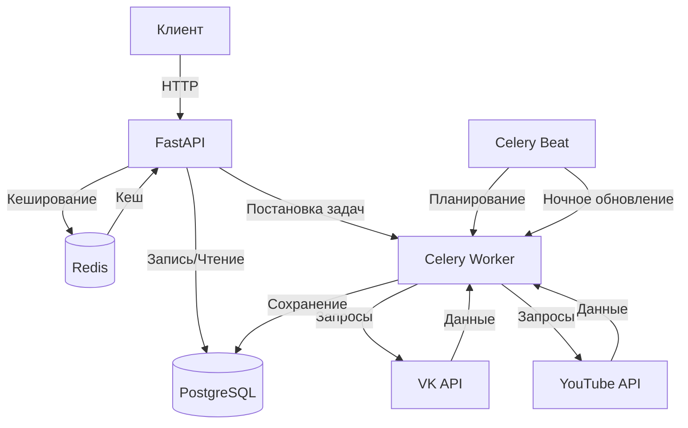

# Social Media Stats Collector

Проект для сбора статистики (количество подписчиков и лайков) из социальных сетей VK и YouTube через их API.

## Технологии

- **Python** (3.11)
- **FastAPI** (0.115.13) - веб-фреймворк для создания API
- **SQLAlchemy** (2.0.41) - ORM для работы с базой данных
- **Celery** (5.5.3) - асинхронная task queue
- **Redis** (6.2.0) - брокер сообщений для Celery
- **PostgreSQL** - реляционная база данных

## Функциональность

- Отправка запросов к API VK для получения:
  - Количества подписчиков
  - Количества лайков на определенных постах
- Отправка запросов к API YouTube для получения:
  - Количества подписчиков
  - Количества лайков на определенных видео
- Асинхронная обработка запросов через Celery
- Кэширование запросов в Redis
- Хранение данных в PostgreSQL




## Установка и запуск

1. Клонируйте репозиторий:
   ```
   git clone git@github.com:Kalmar4uk/checksub.git
   ```
3. Создайте и активируйте виртуальное окружение:
   ```
   python -m venv venv
   source venv/bin/activate  # для Linux/MacOS
   source venv\Scripts\activate     # для Window
   ```
4. Установите зависимости:
   ```
   pip install -r requirements.txt
   ```
5. Создайте файл .env:
   Ниже необходимые параметры для работы проекта
   ```
   POSTGRES_HOST=localhost_или_хост_бд
   POSTGRES_USER=пользователь
   POSTGRES_DB=название_бд
   POSTGRES_PASSWORD=ваш_пароль
   SECRET_KEY_JWT=необходимо_сгенерировать_токен_для_работы_JWT
   CELERY_BROKER=redis://localhost:6379/0
   CELERY_BACKEND=redis://localhost:6379/1
   VK_TOKEN=токен_вк
   YOU_TUBE_TOKEN=токен_you_tube
   ```
6. Запустите сервисы PostgreSQL и Redis через Docker или установите их локально
7. Примените миграции:
   ```
   alembic upgrade head
   ```
8. Запустите проект:
   Находясь в корте проекта запустить файл **main.py**
   ```
   python main.py
   ```
9. В отдельных терминалах запустите Celery Worker и Beat:
   ```
   celery -A celery_app.config_celery worker -l info --pool=solo
   celery -A celery_app.config_celery beat -l info
   ```
   По желанию можно запустить Flower:
   ```
   celery -A celery_app.config_celery flower
   ```
